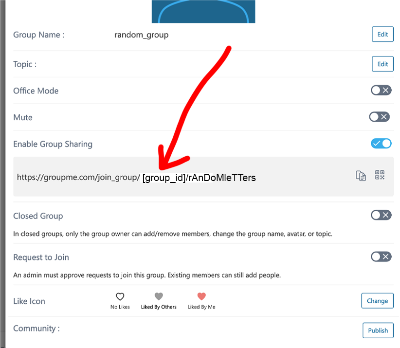

# Python3 Groupme-Tools

Tools to fetch the complete history of a GroupMe group chat and analyze it.


<a href="https://youtu.be/8Rd8VgYF5dY?t=139" target="_blank"></a>
## Example Usage


### fetch 
The fetch command when requires you provide the GroupMe group id of the chat you are 
trying to archive and your access token. You'll also need to specify an output directory
```
python groupme_tools.py fetch -g [Group ID] -t [Your Access Token] -o [Output Directory]
```

### simple
The simple command takes the json file built with the fetch command and makes  
a readable transcript file.
```
python groupme_tools.py simple -js [Path To Json File] -o [Path To Output File].txt
```

### html 
The HTML command takes the json file built with the fetch command and makes an 
HTML file with a reconstruction of the chat history. It also saved all images sent in the chat 

```
python groupme_tools.py html -js [Path To Json File] -o [Directory To Store HTML Assets]
```

### media 
The media command will save specified media types found in the transcript or all of them
when given the `-all` flag

```
python groupme_tools.py media -js [Path To Json File] [-all/-img/-av] 
```

## Finding your access token

If You have any issues with this see [GroupMe API docs](https://dev.groupme.com/docs/v3).

1. Log into [GroupMe's web interface](https://web.groupme.com/groups) and load one of your groups.
2. Select Settings and view the url under "Enable Group Sharing"
3. From this you will see a link appear, your group id will be between the `join_group/` and `/rAdOmLetTerRs/`  part of the url
```
https://groupme.com/join_group/[GROUP_ID]/rAdOmLetTerRs
```


## Requirements 
- Wget
- Requests
`pip install -r requirments.txt`

